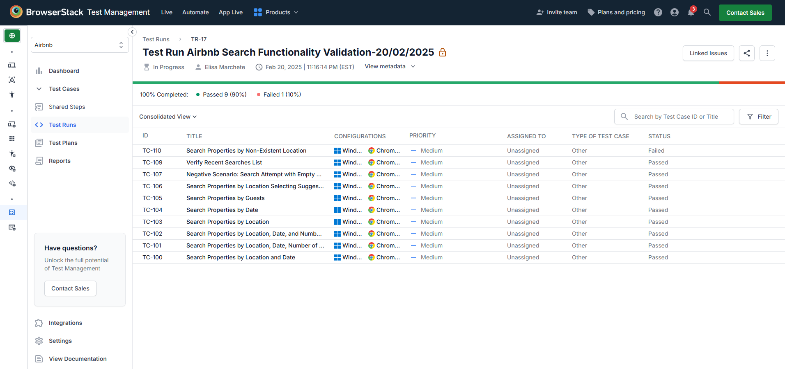
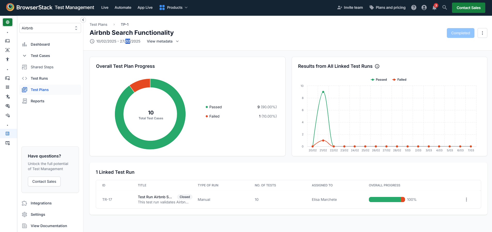
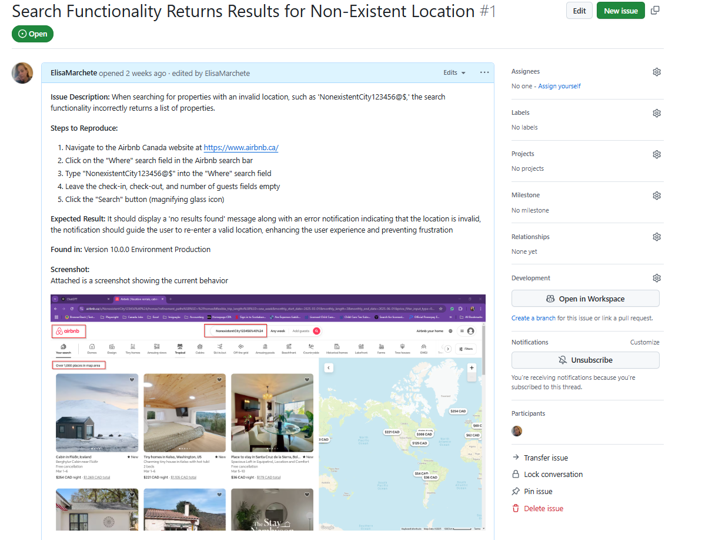
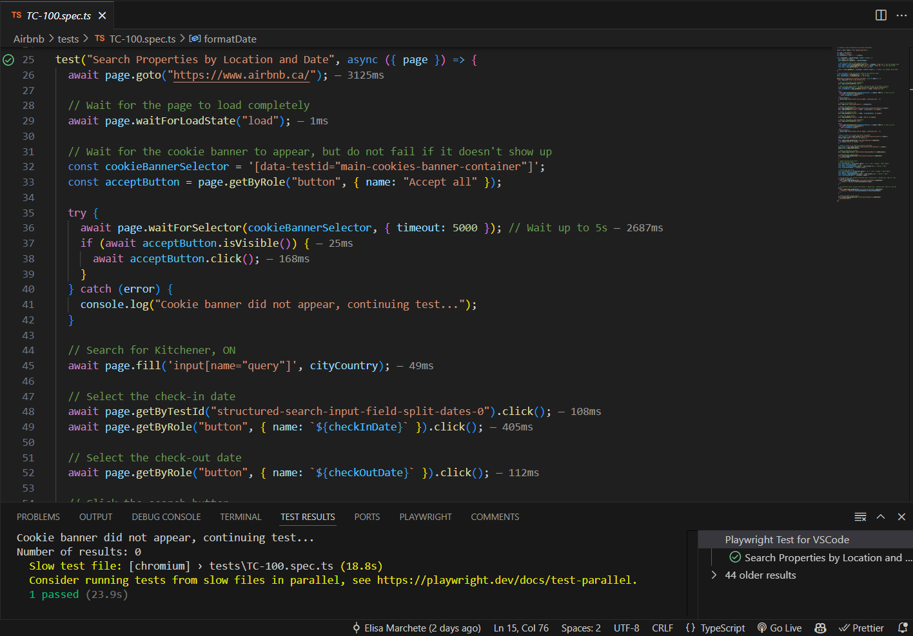

# 🏡 Non-Official Customer Airbnb Testing Repository

This repository showcases my **QA software testing skills** through **manual and automated testing** of Airbnb's search functionality. It includes:

✅ **Manual Testing on BrowserStack** – A test plan is created with clear test cases, and the test run is documented with the results.  
✅ **Bug Reporting in GitHub Issues** – Bug logged for failed test, including issue description, reproduction steps, the expected outcome, details about the testing environment and application version, and screenshot for visual reference.  
✅ **Automated Testing with Playwright** – Automated scripts to validate the search functionality.

## 📂 Repository Structure

### 1️⃣ Manual Testing on BrowserStack

🔹 **Test Run** – [Click to View Test Run](https://test-management.browserstack.com/projects/1510499/test-runs/TR-17?public_token=5c1d60eb68c248268e61dbcced8b8cb713f66aba18371e0f47df3778dfb8ebe4d4729925fe6b92ef3b59486f8c397d6890450d0ce12aae5f2587dc754a879f2f&public_token_id=1162)



🔹 **Test Run Results** – [Click to View test results](https://test-management.browserstack.com/projects/1510499/test-runs/TR-17?public_token=5c1d60eb68c248268e61dbcced8b8cb713f66aba18371e0f47df3778dfb8ebe4d4729925fe6b92ef3b59486f8c397d6890450d0ce12aae5f2587dc754a879f2f&public_token_id=1162)



### 2️⃣ Bug Reports

📌 **Bug logged for failed test (TC-110)** – [Click to View GitHub Issue](https://github.com/ElisaMarchete/airbnb/issues/1)



### 3️⃣ Automated Testing with Playwright

💻 Playwright test scripts for automated functional and visual validation to ensure the application's search functionality works correctly and looks as expected.



## 🚀 Running Playwright Tests

### Prerequisites

Ensure you have **Node.js (LTS version)** installed. You can download it from [nodejs.org](https://nodejs.org/).

1️⃣ **Clone this repository and navigate to test folder:**

```bash
git clone <https://github.com/ElisaMarchete/airbnb.git>
```

```bash
cd airbnb
```

2️⃣ **Install dependencies:**

```bash
npm install
```

```bash
npx playwright install
```

3️⃣ **Run Playwright tests:**

```bash
npx playwright test
```

4️⃣ **View the Report:**

```bash
npx playwright show-report
```

## 🎯 About This Project

This project is part of my QA portfolio, demonstrating my ability to perform end-to-end testing, report defects, and implement test automation.
